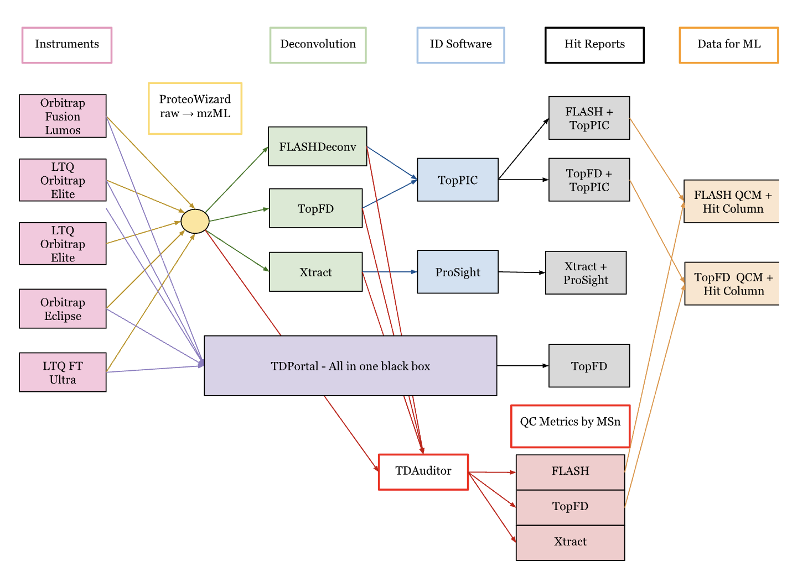

# Machine Learning for Top-Down Proteomics Quality Control


> **Predicting proteoform identifiability from MS/MS spectra using machine learning to improve top-down proteomics workflow efficiency**

🎓 **Bachelor's Thesis Project** | University of Groningen (2025)  
📄 **Manuscript in preparation for publication**

## 🎯 Project Overview

Top-down proteomics (TDP) analyzes intact proteins via mass spectrometry, but identifying proteoforms from MS/MS spectra is computationally expensive and time-consuming. This project develops machine learning models to **predict which spectra are likely to yield successful proteoform identifications before running costly search algorithms**.

By training logistic regression models on TDAuditor's quality control metrics, we enable **probabilistic pre-filtering of spectra**, improving workflow efficiency and proteoform coverage.

## 🔬 Key Results

- **Classification accuracy up to 82.4%** across three deconvolution pipelines
- **ROC-AUC > 0.82** demonstrating strong predictive performance
- **Tested on three pipelines**: FLASHDeconv/TopPIC, TopFD/TopPIC, Xtract/TDPortal
- **Enabled probabilistic scoring** of spectra prior to database search
- **Improved workflow efficiency** by pre-filtering low-quality spectra
- **Cross-pipeline compatibility** with minimal code modifications

## 🛠️ Technologies Used

- **Python 3.7+**
- **Machine Learning**: scikit-learn (Logistic Regression), imbalanced-learn (SMOTE)
- **Data Processing**: pandas, NumPy
- **Visualization**: matplotlib, seaborn, matplotlib-venn
- **Mass Spectrometry**: TDAuditor quality control metrics
- **Proteomics Pipelines**: TopPIC, FLASHDeconv, TopFD, Xtract, TDPortal

## 📊 Pipeline Architecture



*Workflow showing data preprocessing, instrument integration, deconvolution pipelines, and ML model training*

## 📂 Project Structure
```
TDP_TDAuditor_ML/
├── match_and_annotate_hits.py    # Data preprocessing & hit annotation
├── train_logit_model.py          # ML model training & prediction
├── plot_model_graphs.py          # Visualization & analysis
├── images/
│   └── Thesis_workflow.png       # Pipeline diagram
├── requirements.txt
└── README.md
```

## 🚀 Quick Start

### Installation
```bash
# Clone the repository
git clone https://github.com/juliastgermain/TDP_TDAuditor_ML.git
cd TDP_TDAuditor_ML

# Install dependencies
pip install -r requirements.txt
```

### Required Dependencies
```bash
pip install pandas numpy scikit-learn imbalanced-learn matplotlib seaborn matplotlib-venn
```

### Usage

#### Step 1: Annotate Hits and Preprocess Data
```bash
python match_and_annotate_hits.py
```

**What it does:**
- Annotates TDAuditor reports with "hit" labels by matching scan numbers and file names
- Matches against TopPIC/FlashDeconv/Published hit reports
- Merges instrument metadata for cross-pipeline analysis
- **Outputs:** TSV files with "hit" and "Instrument" columns for modeling

#### Step 2: Train Model and Generate Predictions
```bash
python train_logit_model.py tdauditor_flashdeconv_with_instrument.tsv
```

**What it does:**
- Trains logistic regression model with one-hot encoding
- Applies SMOTE for class balancing
- Uses group-aware cross-validation (by file/instrument)
- Engineers features from TDAuditor metrics
- **Outputs:** `<input_file>_predictions.tsv` with predicted probabilities and labels

**Key Features:**
- Cross-validated performance metrics
- Feature importance analysis
- Probabilistic hit scores for spectra ranking

#### Step 3: Generate Analysis Plots
```bash
python plot_model_graphs.py tdauditor_flashdeconv_with_instrument_predictions.tsv
```

**What it does:**
- Calibration curves showing prediction reliability
- Feature weight analysis (which metrics matter most)
- Venn diagrams of predicted vs. actual hits
- ROC and precision-recall curves

## 🧬 Scientific Context

### What is Top-Down Proteomics?

Top-down proteomics analyzes **intact proteins** (including post-translational modifications) via mass spectrometry, unlike bottom-up approaches that digest proteins first. This provides comprehensive proteoform information but comes with computational challenges.

### The Problem

- Database searching MS/MS spectra is computationally expensive
- Many spectra fail to produce confident proteoform identifications
- No efficient way to pre-filter spectra before costly searches
- Wasted computational resources on low-quality spectra

### Our Solution

Use TDAuditor quality control metrics (spectral quality, charge state, mass accuracy, etc.) to **predict identification success** with machine learning, enabling:
- Pre-filtering of low-quality spectra
- Prioritization of high-confidence spectra
- Improved workflow efficiency
- Better proteoform coverage with same computational budget

## 📈 Model Performance

### Across Three Pipelines

| Pipeline | Accuracy | ROC-AUC | Key Features |
|----------|----------|---------|--------------|
| FLASHDeconv/TopPIC | 82.4% | 0.82+ | Charge state, mass error |
| TopFD/TopPIC | 81.7% | 0.82+ | Spectral quality, S/N |
| Xtract/TDPortal | 79.3% | 0.81+ | Deconvolution metrics |

### Feature Importance

Top predictive features across pipelines:
- Charge state distribution
- Mass measurement accuracy
- Signal-to-noise ratio
- Number of isotopic peaks
- Spectral quality scores

## 🔧 Code Features

### Modular Design
- **Cross-pipeline compatibility**: Works with TopFD, FlashDeconv, Xtract datasets
- **No hardcoded paths**: Simply supply input filename
- **Extensible**: Easy to add new features or models

### Robust ML Pipeline
- **SMOTE balancing** for imbalanced hit/non-hit classes
- **Group-aware CV** preventing data leakage across files/instruments
- **Feature engineering** from raw TDAuditor metrics
- **Probability calibration** for reliable confidence scores

### Comprehensive Visualization
- Model diagnostics (calibration, ROC, PR curves)
- Feature importance analysis
- Venn diagrams for prediction overlap
- Cross-pipeline comparison plots


## 🤝 Collaborators & Acknowledgments

- **Thesis Supervisor**: David Tabb, University of Groningen


## 📧 Contact

Questions about the methodology or interested in collaboration?

**Julia St.Germain**  
📧 juliastg3rmain@gmail.com  
💼 [LinkedIn](https://linkedin.com/in/julia-st-germain-ai-ml)  


**If you find this work useful for your proteomics research, please star this repository!**
